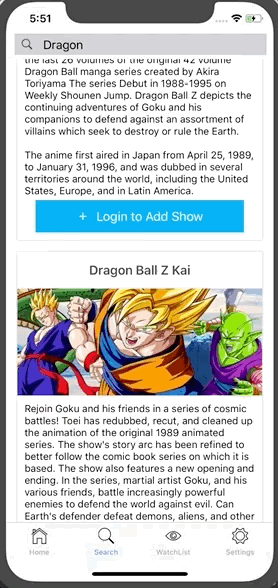

<h1 align="left">What's On Native App</h1>

## Overview

**When is that show coming back??** This mobile app is for those unfortunate souls who forget when their favorite shows will be back on air. With this app you will never miss a new episode or premiere again. 

---
## Screenshots

**Home**

**Search**

**Login**

---
## User Story

**Tory:** 
Tory is a 25 year old woman who leads a very busy lifestyle and works in marketing. When she is not at work she is catching up on her favorite shows. One night she is searching for something to watch but wow, it sure seemed like there were more shows on her agenda last fall. Try as she might she could not rember all the shows she was keeping up with last year. She wishes there was an app that had a list of the shows she was keeping up with last year in addition to the dates and times they would air again. Heck, lets get crazy, wouldn't it be great if it alerted her phone the week the show was coming back on?

---

## MVP Requirements

* **Ability to search** tv shows by title
* **Ability to login/out user** with an impressive rails backend
* **Ability to register users** 
* **Ability to save** user's favorite show to backend
* **Ability to delete** shows per user interphase

## Rockstar Requirements

* **Ability to update** user password?
* **Ability to request** email change by email?
* **Ability to filter** search by region
* **Show ratings** of episodes
* **Ability to show** episode details
* **Ability to send push** notifications to user when show is coming back on

---

## Technologies

- React Native
- Rails

---
### Timeline 

- **12/11 - 12/13**: Research and decide which platform to use. Create basic outline for project and proposal. Get proposal approved. 
- **12/13 - 12/14**: Continue research, complete backend api.
- **12/14 - 12/15**: MVP Complete
- **12/16 - 12/17**: Styling Complete, possiblly add Rockstar items
- **12/20**: SCIENCE FAIR AND GRADUATION!!!!!!! WE MADE IT!!! YAY!!!

---

## Wireframes, Data Model, & React Components Outline
**Wireframe** 
 

**Data Model**
 

**React Components**

---

## Possible Issues

- This project was supposed to be a chrome extension but I could not get oath2 to work propely and I was running out of time
- The fact that I have never used React Native before
- Multiple api calls needed for filtering
- Styling in Native
- Deploying to Heroku?

---

# Additional

* System dependencies
  - auth0-js
  - axios
  - expo
  - native-base
  - react
  - react-native
  - react-native-elements
  - react-native-vector-icons
  - react-navigation

* Configuration

* Database creation
 
* Database initialization

* How to run the test suite
  - clone repo, install dependencies, then yarn run
  - download expo mobile client on your mobile device or expo xde on your desktop then follow instructions

* Deployment instructions

